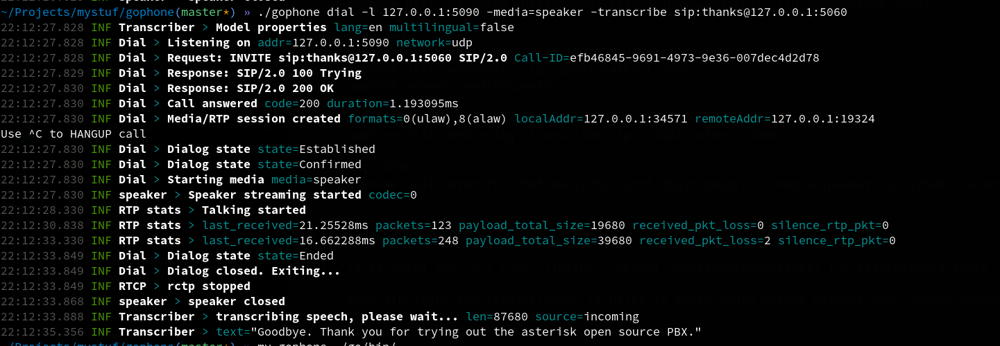

**GOPHONE** is single binary CLI SIP Softphone written in GO and powered by [sipgo](https://github.com/emiago/sipgo) and [sipgox](https://github.com/emiago/sipgox)

<p></p>

```bash
gophone dial -media=audio sip:alice@sip.dev.server:5060
```

Most of code is on libraries mentioned with exception for some some audio processing and media setup. 
It is mainly developed for automated testing purpose and minimal logging for understanding call state.

Any feature/bug or supporting this is open for discussing. 

### Cross Platform builds:
- [x] Linux amd64
- [x] Windows
- [ ] macOS amd64


For audio it expected you have some preinstalled libraries

### Major features:
- 3 actions: **Dial, Answer or Register**
- **Media IO control**: speaker, mic, file
- **RTP statistics** during call
- **Offline Speech To text** Transcription of phone call  using [whisper models](https://openai.com/research/whisper) 
- Provides also **json** type output for easier filtering.


**Roadmap:**
- [x] Use flags to automate call scenario of one endpoint
- [x] Dial Answer Register
- [x] Media encoders: ulaw, alaw
- [x] Media IO: rtp logging, speaker, microphone
- [x] RTP stats: packets, packet loss, talking/silence
- [x] Different responses NoAnswer,Busy
- [x] Offline Speech To text Transcription for output.
- [x] Offline Speech To text Transcription for input
- [x] Sending DTMF rfc4733 with delay control
- [ ] Transfers, BlindTransfer, AttendedTransfer automation as subcommand of dial/answer
- [ ] Recording audio for easier visiting later
- [ ] Logging SIP traces to file
- [ ] Loadtest examples


# Quick start

## Install

gophone is single binary so you only need to download and run it.

You can [Download from here](https://github.com/emiago/gophone/releases/latest/) or 
here quick links 

- Linux https://github.com/emiago/gophone/releases/latest/download/gophone-linux-amd64
- Windows https://github.com/emiago/gophone/releases/latest/download/gophone-windows


## Usage 

```bash
$>gophone -h
Usage of gophone command:

Commands:
  register      Send register request
  dial          Dial destination
  answer        Answer call

  -t string
    	Transport udp|tcp|tls|ws|wss (default "udp")

Enviroment variables:
  LOG_LEVEL=debug|info|error            Log level for output. Default=info
  LOG_FORMAT=json|console               Log format for output. Default=console
  LOG_NOCOLOR                           Disable color
  SIP_DEBUG                             LOG SIP traffic. Used with LOG_LEVEL=debug
  RTP_DEBUG                             LOG RTP traffic. Used with LOG_LEVEL=debug
  RTCP_DEBUG                            LOG RTCP traffic. Used with LOG_LEVEL=debug
  GOPHONE_MEDIA=<same as -media>        Sets default media in case of calls

Examples:
gophone answer -l 127.0.0.200:5060 
gophone answer -l 127.0.0.200:5060 -code 486 -reason Busy
gophone dial sip:1234@127.0.0.200:5060
gophone dial -sipheader="X-AccountId:test123" sip:1234@server:5060
gophone register -username=sipgo -password=1234 127.0.0.1:5060 

with digest authentication:
gophone dial -ua alice -username=alice1234 -password=1234 "sip:echo@server:5060"

with media:
gophone dial -media=audio sip:1234@localhost:5060
gophone dial -media=mic sip:1234@localhost:5060
gophone answer -media=speaker

with transcribe:
gophone dial -media=log -transcribe sip:1234@localhost:5060

with DTMF:
gophone dial -dtmf=79 -dtmf_delay=8s -dtmf_digit_delay=1s -media=speaker sip:1234@localhost:5060
```


## Output example

Running a full call and transcription output at end.

