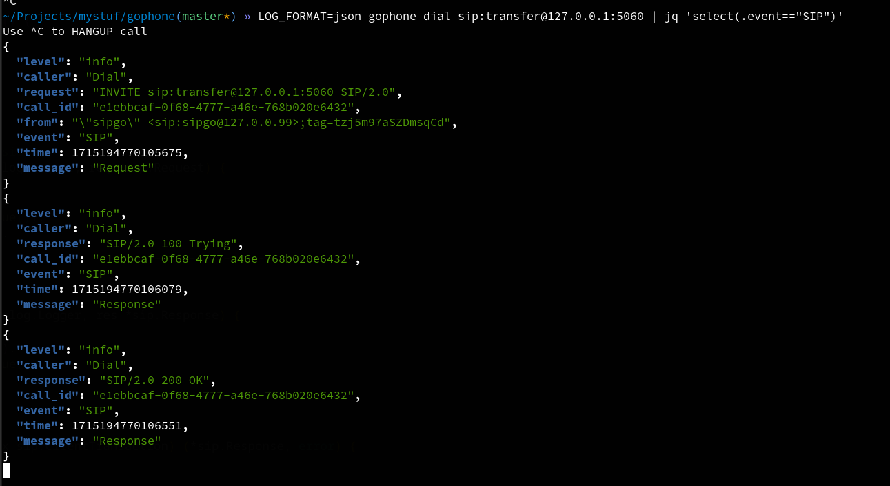

**GOPHONE** is single binary CLI SIP Softphone written in GO and powered by [diago](https://github.com/emiago/diago)

<p></p>

```bash
gophone dial -media=audio sip:alice@sip.dev.server:5060
```
NOT Open Source, but most of code is on libraries mentioned with exception for some some audio streaming and media setup. This also 
shows power of this libs. 
It is mainly developed for simple automated testing purpose, but with Simple API and better integration with other shell tools.

Any feature/bug or supporting/sponzoring is welcomed.

### Cross Platform builds:
- [x] Linux amd64
- [x] Linux arm64 (no call transcription supported)
- [x] Windows
- [x] macOS amd64 (***NOT SIGNED**) Check [MacOS malware detect](#macos-malware-detect)
- [x] macOS arm64 (no call transcription supported) (***NOT SIGNED**) Check [MacOS malware detec](#macos-malware-detect)

For audio it expected you have some preinstalled libraries.

### Major features:
- 3 actions: **Dial, Answer or Register**
- **Media IO control**: speaker, mic, file
- **RTP statistics** during call
- **Offline Speech To text** Transcription of phone call  using [whisper models](https://openai.com/research/whisper) 
- Provides also **json** type output for easier filtering and post verification
- **OPUS** codec support


**Roadmap/Features:**
- [x] Use flags to automate call scenario of one endpoint
- [x] Dial Answer Register
- [x] Media encoders: ulaw, alaw
- [x] Media IO: rtp logging, speaker, microphone
- [x] RTP stats: packets, packet loss, talking/silence
- [x] Different responses NoAnswer,Busy
- [x] Offline Speech To text Transcription for output.
- [x] Offline Speech To text Transcription for input
- [x] Sending DTMF rfc4733 with delay control
- [x] Simple INTERACTIVE mode Commands via STDIN
- [x] BlindTransfer automation as subcommand of dial/answer
- [x] Opus codec support
- [x] Controling audio formats like pcmu,pcma and opus
- [x] N Step Loadtester integrated with SIP and media metrics
- [ ] AttendedTransfer automation as subcommand of dial/answer
- [ ] Recording audio for easier visiting later
- [ ] Better events logging in Structured logging for easier JSON verification.
- [ ] Logging SIP traces to file
- [ ] SIP over WebRTC


# Quick start

## Install

gophone is single binary so you only need to download and run it.

You can [Download from here](https://github.com/emiago/gophone/releases/latest/) or 
here quick links 

- Linux amd64 https://github.com/emiago/gophone/releases/latest/download/gophone-linux-amd64
- Linux arm64 https://github.com/emiago/gophone/releases/latest/download/gophone-linux-arm64
- Macos amd64 https://github.com/emiago/gophone/releases/latest/download/gophone-darwin-amd64.tar.gz
- Macos arm64 https://github.com/emiago/gophone/releases/latest/download/gophone-darwin-arm64.tar.gz

Windows builds will be added on request!

## Or use Docker

```bash
docker run --rm -it emiago/gophone
```
> Docker version has no Audio and Transcription built in! 

### With OPUS codec

- Linux amd64 https://github.com/emiago/gophone/releases/latest/download/gophone-linux-opus-amd64

Install codec:
```bash 
# Debian, Ubuntu
sudo apt install libopus0

# Fedora
sudo dnf install opus
```

```bash
gophone dial -audio_formats=opus,pcma,pcmu sip:123@sip.server.com
```

**If you need opus binary for your platform please open issue** For now it just Linux amd64 exposed

## Usage 

```bash
$>gophone -h
gophone is CLI SIP softphone powered by sipgo library.
To find more information about tool and licences visit
https://github.com/emiago/gophone

Usage of gophone command:

Commands:
  dial          Dial destination.
  answer        Answer call
  register      Send register request only without answer.
  loadtest      N Step call load testing

  -t string
    	Transport udp|tcp|tls|ws|wss (default "udp")

Enviroment variables:
  LOG_LEVEL=debug|info|error            Log level for output. Default=info
  LOG_FORMAT=json|console               Log format for output. Default=console
  LOG_NOCOLOR                           Disable color
  SIP_DEBUG                             LOG SIP traffic. Used with LOG_LEVEL=debug
  RTP_DEBUG                             LOG RTP traffic. Used with LOG_LEVEL=debug
  RTCP_DEBUG                            LOG RTCP traffic. Used with LOG_LEVEL=debug
  GOPHONE_MEDIA=<same as -media>        Sets default media in case of calls

Answer:
gophone answer -l 127.0.0.200:5060 
gophone answer -l 127.0.0.200:5060 -code 486 -reason Busy

Answer with register:
gophone  answer -ua alice -username alice1234 -password 1234 -register "127.0.0.1:5060"

Dial:
gophone dial sip:1234@127.0.0.200:5060
gophone dial -sipheader="X-AccountId:test123" sip:1234@server:5060

Register:
gophone register -username=sipgo -password=1234 127.0.0.1:5060 

With digest authentication:
gophone dial -ua alice -username=alice1234 -password=1234 "sip:echo@server:5060"

With media:
gophone dial -media=audio sip:1234@localhost:5060
gophone dial -media=mic sip:1234@localhost:5060
gophone answer -media=speaker

With transcribe:
gophone dial -media=log -transcribe sip:1234@localhost:5060

With DTMF:
gophone dial -dtmf=79 -dtmf_delay=8s -dtmf_digit_delay=1s -media=speaker sip:1234@localhost:5060

With INTERACTIVE mode:
echo "wait=3s; dtmf=123; hangup;" | gophone dial -i -media=speaker sip:demo@127.0.0.1:5060
```


## Output example

Running a full call and transcription output at end.


## Using jq and json format to verify output

Using json allows some post verification for your call setup.




**Useful filtering**
```bash 
gophone ... | jq 'select(.caller=="Dial" and .event=="SIP")'
gophone ... | jq 'select(.caller=="Dial" and .event=="DialogState")'
```


### Media Testing with transcriber

```bash
CALLTRANSCRIPTION=$(LOG_FORMAT=json gophone dial -transcribe sip:49123456789@carrier.xy \
    | jq -r 'select(.caller=="Transcriber" and .text != null) | .text')

test "Please enter your PIN. Your answer is, 1234." = $CALLTRANSCRIPTION
```

## Load Testing 

**To ensure the continued development and maintenance of gophone, this feature is exposed only for supporters(sponsors) of this or other projects in repo. If you are interested having this feature you can contact me on** [mail](mailto:emirfreelance91@gmail.com) **and you will receive build**


N Step based Load Test for your SIP + RTP media server

Features:
- Providing SIP + RTP metrics during test execution!
- Allows you to define **alarm thresholds** (ALARM_VALUES) on which call information is dumped, which after you can use to analyze in your PCAPs
- Rate is automatically distributed based on number of steps and rate range

Checkout Demo: https://youtu.be/VXNt7RP4TLc

Load test feature is N Step call based load testing where on each next step your rate of calls is increased. 
This allows you to see behavior of SIP server under different rate of pressure and call concurrency

```bash
Gophone call loadtester.
Media Codec: ulaw, alaw
Transport:UDP,TCP

Usage: loadtest SIPURI

SIPURI format:
  exten
  sip:user@ip

Flags:
  -alarm_rtp_r value
    	Set alarm threshold as key:value which will dump call when reached. Can be multiple defined  or comma separated. ALARM_RTP_VALUES
  -alarm_rtp_w value
    	Set alarm threshold as key:value which will dump call when reached. Can be multiple defined or comma separated. ALARM_RTP_VALUES
  -alarm_sip value
    	Set alarm threshold as key:value which will dump call when reached. Can be multiple defined or comma separated. ALARM_SIP_VALUES
  -audio_file string
    	Play wav audio file. NOTE: sample rate, bit depth must match codec used
  -call_duration duration
    	Duration of call (e.g., 30s, 1m) (default 30s)
  -duration duration
    	Total duration which will be divided by steps (e.g., 30s, 1m) (default 5m0s)
  -l string
    	My listen ip
  -rate_interval duration
    	Rate interval in seconds (default 1s)
  -rate_max int
    	Maximum requests per second (default 10)
  -rate_start int
    	Initial requests per second (default 1)
  -rate_steps int
    	Number of steps to ramp up/down (default 5)
  -t string
    	Transport udp|tcp (default "udp")
  -ua string
    	User agent of phone (default "sipgo")
  -ua_auto_inc
    	Adds suffix number on user agent and auto increments for every new call. Allows to distinct calls in your tests
  -ua_host string
    	User agent host in From header

ALARM_RTP_VALUES:
  - pkt_loss:int Default:0 RTP Packet Total Loss
  - pkt_loss_fraction_perc:int[0-100] Default:0 RTP Fraction Packet Loss based on RTCP interval
  - jitter_ms:int Default:0 RTP Jitter In Milliseconds

ALARM_SIP_VALUES:
  - early_hangup:bool Default:false Early hangup by remote side
  - max_ring_time:duration Default:0 Max ring time expected 

EXAMPLES:
Minimal:
gophone loadtest sip:test@sip.server.xy

Custom rate:
gophone loadtest -rate_start=1 -rate_max=5 -rate_interval=5s sip:test@sip.server.xy

With RTP Alarms:
gophone loadtest -alarm_rtp_r="pkt_loss_perc:5,jitter_ms:25" -alarm_rtp_w="jitter_ms=30" sip:491234566@sip.server.xy

With SIP Alarms:
gophone loadtest  -alarm_sip="max_ring_time=5s" sip:491234566@sip.server.xy
```

## MacOS malware detect

gophone CLI tool is **not signed** by Apple Developer Program and may be shown as **Malware** by your **Gatekeeper**. This is something Apple started to require on newer OS (From Catalina v10.15). FYI: in order to sign binary Apple requires annual payment. This project is not yet sponsored or had requirement todo so.

For allowing unsigned CLI tool to run here are some articles to check. 
- https://support.apple.com/en-us/102445#:~:text=If%20you%20want%20to%20open,Mac%20or%20compromise%20your%20privacy.
- https://github.molgen.mpg.de/pages/bs/macOSnotes/mac/mac_procs_unsigned.html
- https://openecoacoustics.org/resources/help-centre/software/unsigned/
